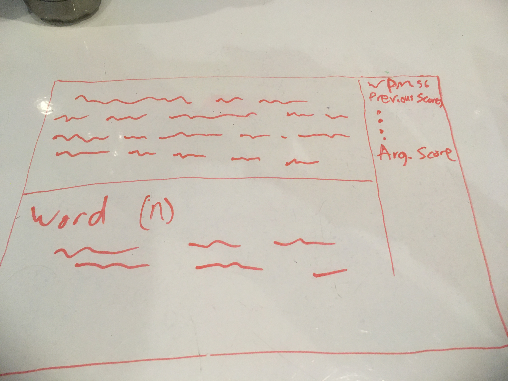

#Typing Test
This is a game that measures how fast you can type. It generates random words from an api. It will measure your typing speed in words per minute. It will also save and display your score.
##Wireframe

##API Data
```    {
      "word": "example",
      "definitions": [
        {
          "definition": "a representative form or pattern",
          "partOfSpeech": "noun"
        },
        {
          "definition": "something to be imitated",
          "partOfSpeech": "noun"
        },
        {
          "definition": "an occurrence of something",
          "partOfSpeech": "noun"
        },
        {
          "definition": "an item of information that is typical of a class or group",
          "partOfSpeech": "noun"
        },
        {
          "definition": "punishment intended as a warning to others",
          "partOfSpeech": "noun"
        },
        {
          "definition": "a task performed or problem solved in order to develop skill or understanding",
          "partOfSpeech": "noun"
        }
      ]
    }
```

## Features
- Area with words to be typed
- Typing speed and average score, saved to user's computer
### Stretch Goals
- word definition and other info
